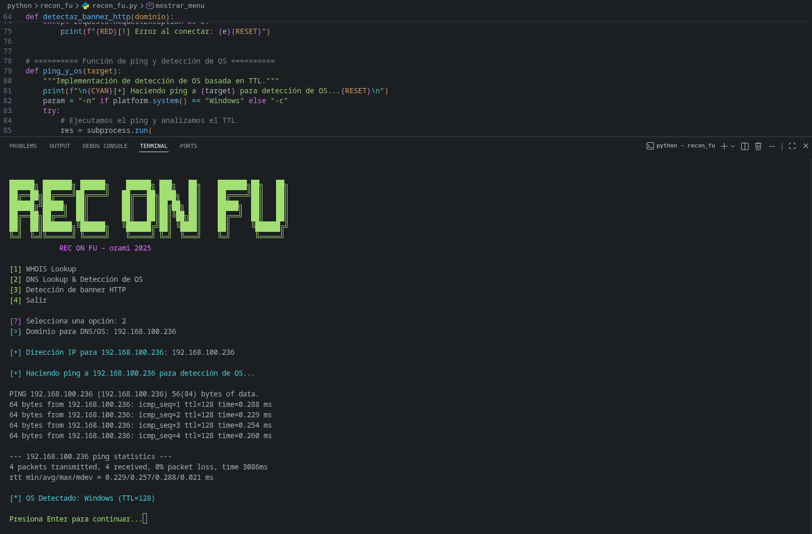

# Re-con Fu

Recon Fu es una herramienta de consola creada para practicar tareas simples de reconocimiento sobre dominios y servidores.

## Screenshots




## Funciones

- Consulta WHOIS.
- Resolución DNS básica.
- Ping con detección aproximada de sistema operativo.
- Lectura de encabezados HTTP.

## Requisitos

- Python 3.11 o superior

## Instalación

```bash
python3 -m venv .venv
source .venv/bin/activate
pip install -r requirements.txt
```

## Ejecución

```bash
python recon_fu.py
```

## Estructura

- `recon_fu.py`: archivo principal del proyecto.
- `requirements.txt`: dependencias de Python.
- `img/`: capturas opcionales.

## Nota

Este proyecto está pensado para aprendizaje y debe usarse solo en entornos permitidos.
